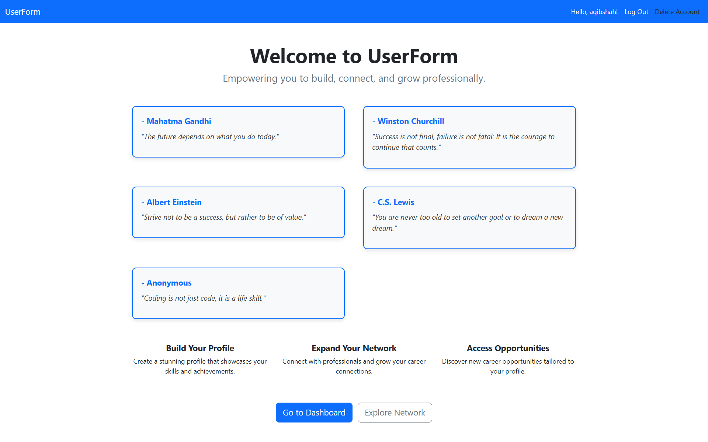

# UserForm

## Overview

**UserForm** is a simple Django-based signup and login system with templates for user authentication. It allows users to register, log in.

## API Endpoints

Below is a list of the available endpoints in the application:

### Base URL
All endpoints are relative to the base URL of your application.

---

### **Endpoints**

1. **Home**
    - **URL:** `/`
    - **Method:** `GET`
    - **Description:** Displays the home page of the application.

2. **Register User**
    - **URL:** `/register/`
    - **Method:** `POST`
    - **Description:** Allows a new user to register by submitting their details.

3. **Login User**
    - **URL:** `/login/`
    - **Method:** `POST`
    - **Description:** Authenticates an existing user and logs them in.

4. **Logout User**
    - **URL:** `/logout/`
    - **Method:** `GET`
    - **Description:** Logs out the currently authenticated user.

5. **Reset Password**
    - **URL:** `/reset-password/`
    - **Method:** `POST`
    - **Description:** Allows users to reset their password.

6. **Delete User**
    - **URL:** `/delete-user/`
    - **Method:** `DELETE`
    - **Description:** Deletes the currently authenticated user's account.
